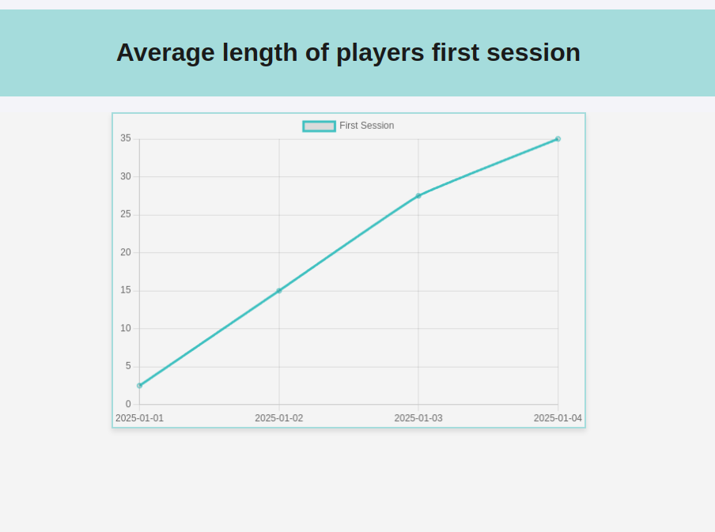

There is a graph showing the Average length of players first session.

To configure the database create .env file from .env.example

Data for graph placed in data/player_events.csv

Screenshot with result: 

Points on the graph:

2025-01-01 - 2,5

2025-01-02 - 15

2025-01-03 - 27,5

2025-01-04 - 35